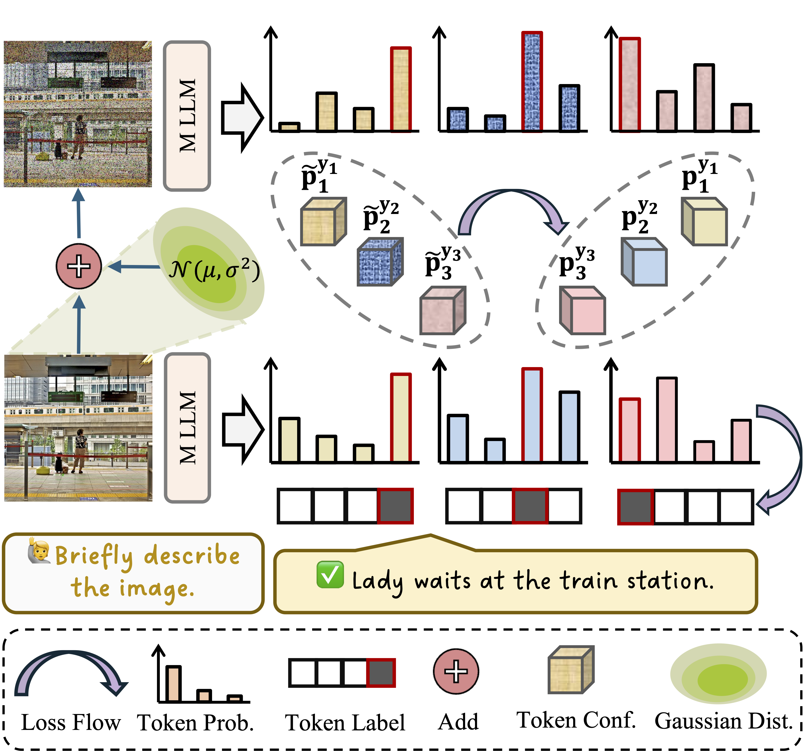

# Be Confident: Uncovering Overfitting in MLLM Multi-Task Tuning

> Wenke Huang, Jian Liang, Guancheng Wan, Didi Zhu, He Li, Jiawei Shao, Mang Ye, Bo Du, Dacheng Tao

> *ICML, 2025*  [Link](https://openreview.net/forum?id=bif35if4n3)


<p align="center">

</p>


## 🙌 Abstract
Fine-tuning Multimodal Large Language Models (MLLMs) in multi-task learning scenarios has emerged as an effective strategy for achieving cross-domain specialization. However, multi-task fine-tuning frequently induces performance degradation on open-response datasets. We posit that free-form answer generation primarily depends on language priors, and strengthening the integration of visual behavioral cues is critical for enhancing prediction robustness. In this work, we propose Noise Resilient Confidence Alignment to address the challenge of open-response overfitting during multi-task fine-tuning. Our approach prioritizes maintaining consistent prediction patterns in MLLMs across varying visual input qualities. To achieve this, we employ Gaussian perturbations to synthesize distorted visual inputs and enforce token prediction confidence alignment towards the normal visual branch. By explicitly linking confidence calibration to visual robustness, this method reduces over-reliance on language priors. We conduct extensive empirical evaluations across diverse multi-task downstream settings via popular MLLM architectures. The comprehensive experiment demonstrates the effectiveness of our method, showcasing its ability to alleviate open-response overfitting while maintaining satisfying multi-task fine-tuning performance.


## 🥳 Citation

If you find this repository helpful for your research, we would greatly appreciate it if you could cite our papers. ✨

```bibtex
@inproceedings{NRCA,
    title={Be Confident: Uncovering Overfitting in {MLLM} Multi-Task Tuning},
    author={Wenke Huang and Jian Liang and Guancheng Wan and Didi Zhu and He Li and Jiawei Shao and Mang Ye and Bo Du and Dacheng Tao},
    booktitle={ICML},
    year={2025}
}

@misc{MLLMTuning_arXiv25,
    title={Keeping Yourself is Important in Downstream Tuning Multimodal Large Language Model}, 
    author={Wenke Huang, Jian Liang, Xianda Guo, Yiyang Fang, Guancheng Wan, Xuankun Rong, Chi Wen, Zekun Shi,  Qingyun Li, Didi Zhu, Yanbiao Ma, Ke Liang, Bin Yang, He Li, Jiawei Shao, Mang Ye, Bo Du},
    year={2025},
    eprint={2503.04543},
    archivePrefix={arXiv},
    primaryClass={cs.CR}
}

@inproceedings{LiangLoRASculpt_CVPR2025,
    author    = {Liang, Jian and Huang, Wenke and Wan, Guancheng and Yang, Qu and Ye, Mang},
    title     = {LoRASculpt: Sculpting LoRA for Harmonizing General and Specialized Knowledge in Multimodal Large Language Models},
    booktitle = {CVPR},
    year      = {2025},
}
```

## 🔍 Relevant Projects
[1] Keeping Yourself is Important in Downstream Tuning Multimodal Large Language Model - arXiv 2025  [[Link](https://arxiv.org/abs/2503.04543)][[Code](https://github.com/WenkeHuang/Awesome-MLLM-Tuning)]

[2] Learn from Downstream and Be Yourself in Multimodal Large Language Models Fine-Tuning - ICML 2025  [[Link](https://openreview.net/forum?id=bif35if4n3)][[Code](https://github.com/WenkeHuang/NRCA)]

[3] LoRASculpt: Sculpting LoRA for Harmonizing General and Specialized Knowledge in Multimodal Large Language Models - CVPR 2025 Oral [[Link](https://arxiv.org/abs/2503.16843)][[Code](https://github.com/LiangJian24/LoRASculpt)]

